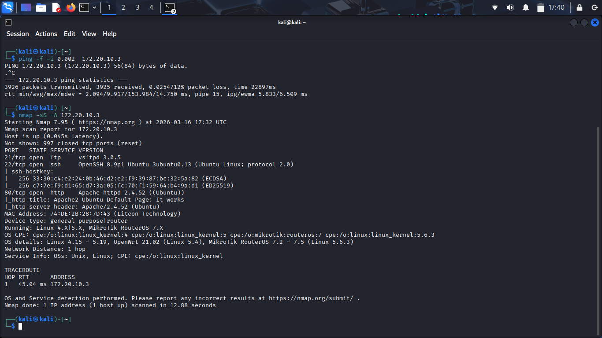
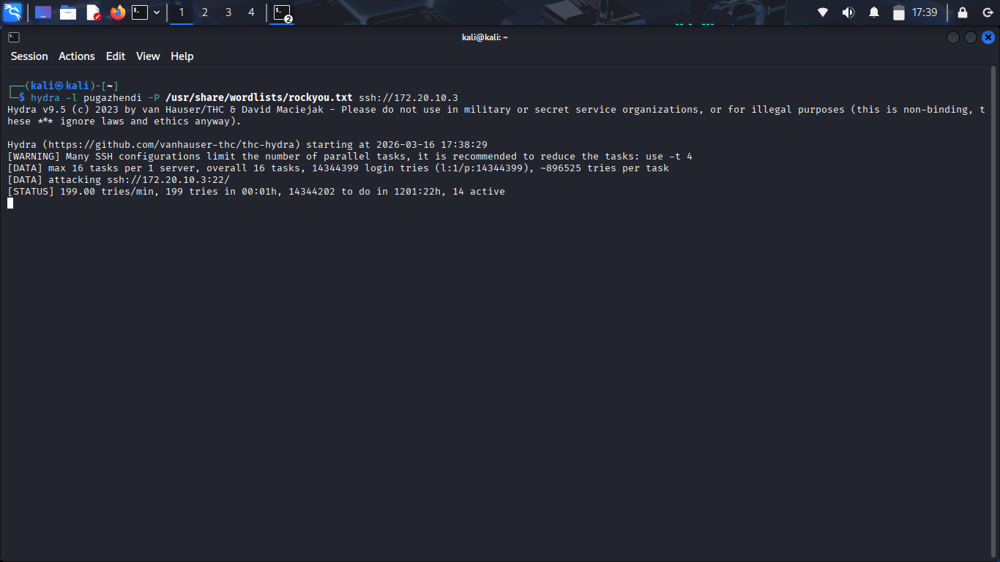
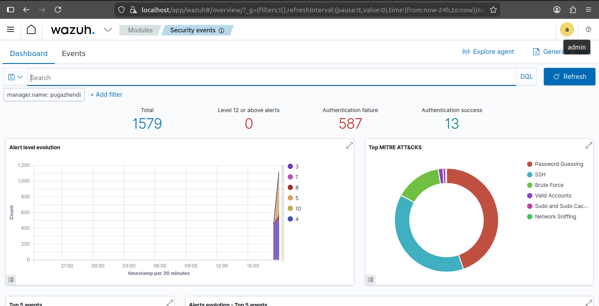
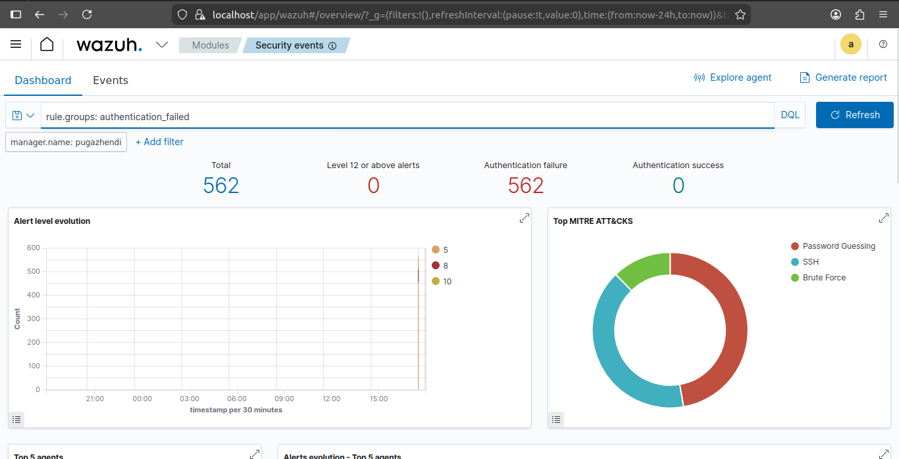
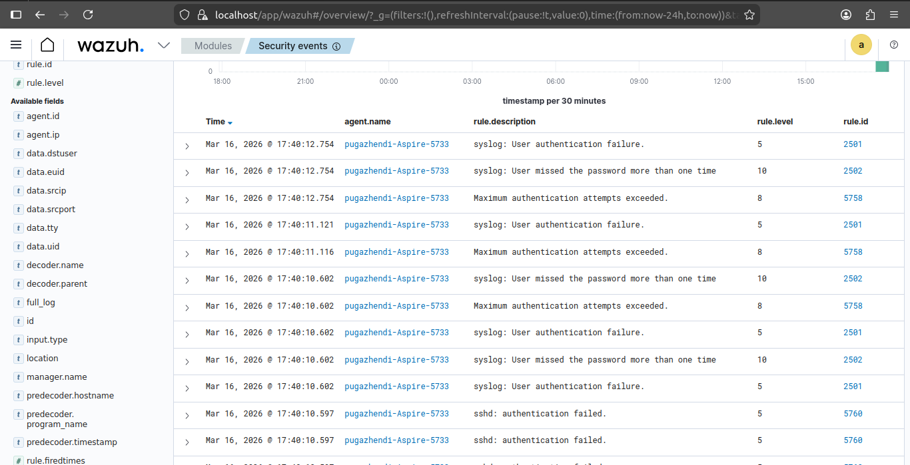
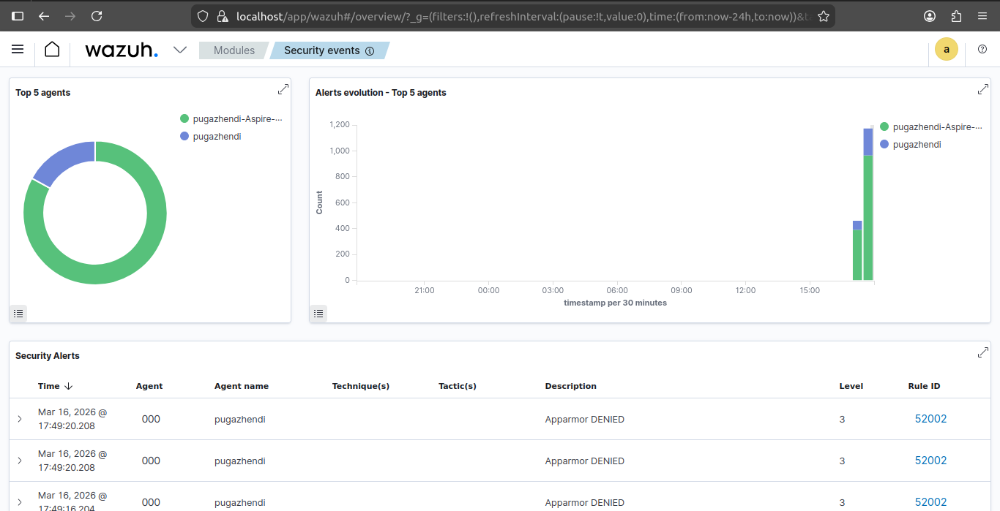
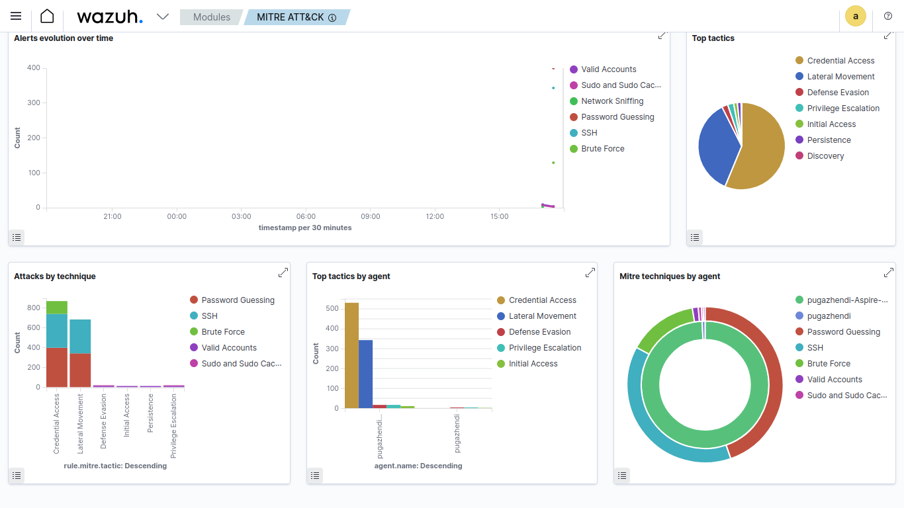

# 🛡️ SOC Attack Detection Lab (Kali + Wazuh SIEM)


---

## 📌 Overview

A hands-on Security Operations Center (SOC) lab built across three physical machines to simulate real-world attack scenarios and monitor them using Wazuh SIEM. The lab demonstrates how a SOC analyst detects, investigates, and responds to active threats using industry-standard tools and the MITRE ATT&CK framework.

> **Goal:** Understand how SOCs detect and investigate attacks by simulating attacker behavior and analyzing security events in a SIEM dashboard.

---

## 🖥️ Lab Architecture

```
┌─────────────────────────────────────────────────────────┐
│                     Physical Network                    │
│                                                         │
│  ┌─────────────────┐         ┌─────────────────────┐   │
│  │   Kali Linux    │─────────▶  Linux Mint          │   │
│  │   (Attacker)    │  Attack  │  pugazhendi-Aspire  │   │
│  │  172.20.10.x    │         │   172.20.10.3        │   │
│  └─────────────────┘         └──────────┬──────────┘   │
│                                         │ Wazuh Agent   │
│                                         ▼               │
│                               ┌─────────────────────┐   │
│                               │   Ubuntu Server     │   │
│                               │  Wazuh Manager +    │   │
│                               │     Dashboard       │   │
│                               │   pugazhendi        │   │
│                               └─────────────────────┘   │
└─────────────────────────────────────────────────────────┘
```

---

## 🧰 Tools & Technologies

| Tool | Role |
|---|---|
| **Wazuh 4.x** | SIEM Manager — collects, correlates, and alerts on security events |
| **Kali Linux** | Attacker machine — runs offensive tools |
| **Linux Mint** | Victim endpoint — monitored by Wazuh Agent |
| **Ubuntu Server** | Wazuh Manager host |
| **Nmap** | Network reconnaissance and port scanning |
| **Hydra** | SSH brute-force attack tool |

---

## ⚔️ Attack Scenarios Simulated

### 1. 🔍 Network Reconnaissance — Nmap
```bash
ping -f -i 0.002 172.20.10.3          # Ping flood
nmap -sS -A 172.20.10.3               # Stealth SYN scan + service detection
```
**Discovered open ports on victim:**
- Port 21 — FTP (vsftpd 3.0.5)
- Port 22 — SSH (OpenSSH 8.9p1)
- Port 80 — HTTP (Apache 2.4.52)



---

### 2. 🔑 SSH Brute Force — Hydra
```bash
hydra -l pugazhendi -P /usr/share/wordlists/rockyou.txt ssh://172.20.10.3
```
- **14,344,399** login attempts queued from rockyou.txt wordlist
- **199 tries/minute** actively running against SSH port 22
- **Zero successful logins** — system was not breached



---

## 📊 Wazuh Detection Results

### Security Events Overview
| Metric | Value |
|---|---|
| Total Alerts Generated | **1,579** |
| Authentication Failures | **587** |
| Authentication Successes | **13** |
| Level 12+ Critical Alerts | **0** |



---

### Authentication Failure Analysis
Filtering by `rule.groups: authentication_failed` revealed **562 pure brute-force events** — 100% failures, 0 successful breaches.



---

### Individual Alert Detail — Rule IDs Triggered

| Rule ID | Description | Severity Level |
|---|---|---|
| 2501 | syslog: User authentication failure | 5 |
| 2502 | User missed password more than once | 10 |
| 5758 | Maximum authentication attempts exceeded | 8 |
| 5760 | sshd: authentication failed | 5 |



---

### Top 5 Agents
The **pugazhendi-Aspire-5733** (Linux Mint victim) generated the majority of alerts, confirming it was the primary target of all attack simulations.



---

## 🎯 MITRE ATT&CK Mapping

Wazuh automatically mapped detected events to the MITRE ATT&CK framework:

### Tactics Detected
| Tactic | Technique | Source |
|---|---|---|
| **Credential Access** | Password Guessing (T1110.001) | Hydra brute force |
| **Lateral Movement** | SSH (T1021.004) | SSH attack attempts |
| **Discovery** | Network Sniffing (T1040) | Nmap scan |
| **Defense Evasion** | — | AppArmor evasion attempts |
| **Privilege Escalation** | — | Sudo activity detected |



---

## 🔑 Key Findings

- ✅ **Wazuh successfully detected all attack scenarios** in real time
- ✅ **562 brute-force attempts** captured and correlated to MITRE T1110.001
- ✅ **Nmap reconnaissance** triggered network sniffing detection
- ✅ **Zero successful breaches** — the system remained secure
- ✅ **MITRE ATT&CK auto-mapping** provided immediate threat context
- ✅ **Multi-agent monitoring** tracked both victim and manager simultaneously

---

## 📁 Project Structure

```
SOC-Attack-Detection-Lab/
│
├── README.md
└── screenshots/
    ├── kali-nmap-ping-scan.png
    ├── kali-hydra-bruteforce.png
    ├── wazuh-security-events-overview.png
    ├── wazuh-auth-failure-filter.png
    ├── wazuh-events-auth-failure-detail.png
    ├── wazuh-top-agents-alerts.png
    └── wazuh-mitre-attack-dashboard.png
```

---

## 💡 Skills Demonstrated

- SIEM deployment and configuration (Wazuh)
- Wazuh agent enrollment and endpoint monitoring
- Offensive security tools usage (Nmap, Hydra) in a controlled lab
- Security event analysis and alert triage
- MITRE ATT&CK framework mapping
- Linux system administration (Ubuntu Server, Linux Mint)
- Network traffic analysis and threat detection

---

## 👤 Author

**Pugazhendi**
- 🌐 [Portfolio](https://pugazhendii22.github.io)
- 💼 [LinkedIn](https://linkedin.com/in/pugazhendii22)
- 🐙 [GitHub](https://github.com/Pugazhendii22)

---

> ⚠️ **Disclaimer:** This lab was conducted in a fully isolated private network environment for educational purposes only. All attack simulations were performed on machines owned and controlled by the author.
